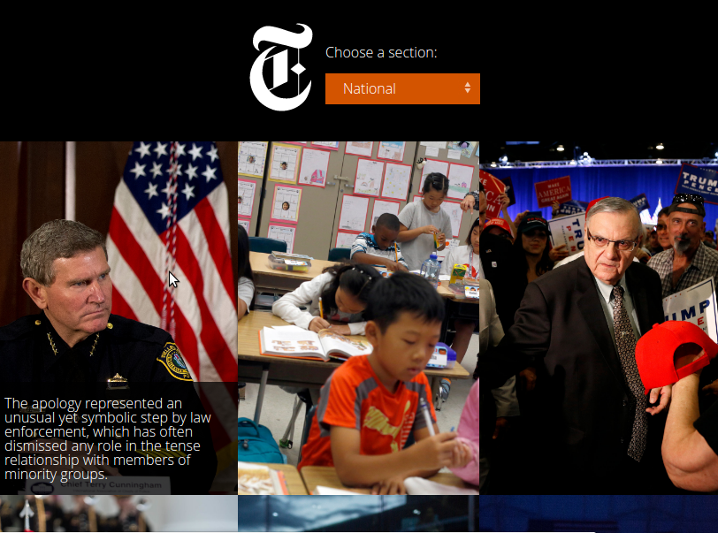

# New York Times Instanews

    

---

# Summary / Purpose

[Instanews](https://scottfuoco.github.io/instanews/) - Instantly recieve the top 12 news stories from your selected category.

It can be a useful reference for the following:
* How to make Ajax calls to a web api
* Gulp task runner setup in the gulpfile.js 
* SASS partials and website style organization
* CSS and Javascript animations/tranistions

---

# Technologies Used
* HTML5
* CSS3 transitions and Flexbox layout
* SCSS - @mixins, variables, and 
* Javascript libraries jQuery and Heapbox

---

# Major Learnings
* How to pull, parse, and populate content with data from a web api.

* Install packages using npm (node package manager)

* Setting up Gulp and running Gulp as a project task runner.  Tasks in this project include:
   * Running BrowserSync to auto-reload the website upon saving project files
   * Linting javascript files to enforce a javascript coding standard
   * Compiling scss files into a single style.css file
   * Minifying both javascript and css files
   * Posting error messages to the terminal

* Using SCSS to organize styles into more easily maintainable and module files.  Also applying mixins to make media queries more readable and usage of variables to simplify changing base/repeated styles by changing a single value.